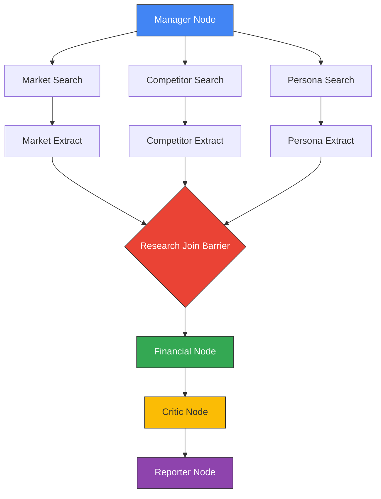

<div align="center">

# 🚀 Multi-Agent Startup Idea Validator

**An evidence-backed, multi-agent market & feasibility analysis engine built with Google ADK 2.0 & Gemini 3.**

*Six specialized AI agents research, stress-test, and mathematically score startup concepts — with strictly zero flattery.*

[](https://www.python.org/)
[](https://fastapi.tiangolo.com/)
[](https://nextjs.org/)
[](https://www.typescriptlang.org/)
[](https://cloud.google.com/)
[](file:///d:/founder%20ai/LICENSE)
[](file:///d:/founder%20ai/backend/tests)

[Explore Features](#-key-features) • [System Architecture](#%EF%B8%8F-system-architecture) • [Quick Start](#-quick-start) • [Scoring Engine](#-deterministic-scoring-engine) • [Testing](#-testing--validation)

---

</div>

## 📌 Overview

The **Multi-Agent Startup Idea Validator** deploys six specialized AI agents to rigorously research and challenge startup ideas. It produces a fully sourced opportunity report and an objective feasibility score out of 100.

> [!IMPORTANT]
> **Core Design Principle: The system must not flatter the founder.**
> - 🎯 **100% Sourced**: Every claim carries an explicit source URL, date, and confidence rating.
> - 📊 **Strict Categorization**: Every metric is explicitly tagged as *sourced*, *calculated*, or *assumed*.
> - 📉 **One-Way Override**: Critic agents can **only lower confidence**, never raise it.
> - 🧮 **Pure Python Scorer**: Final scores are calculated deterministically — **never by an LLM**.

---

## ⚡ Key Features

| Feature | Description |
|---|---|
| 🧠 **Google ADK 2.0 Engine** | Parallel graph runtime managing multi-agent execution branches with fan-in barriers. |
| 🛡️ **Verified Attribution** | Cross-checks cited URLs against `grounding_metadata`. Fabricated links cap confidence at 30%. |
| 🧮 **Deterministic Scorer** | Pure Python rating algorithm incorporating source age decay, diminishing returns, and math ceilings. |
| ⚡ **Real-Time Streaming** | Async FastAPI backend pushing live agent execution status and logs to Next.js via Server-Sent Events (SSE). |
| 🎨 **Accessible UI Design** | Custom dark/light mode surfaces, verified 3:1 contrast ratios, and a fixture preview route (`/preview`). |

---

## 🏗️ System Architecture

### Agent Workflow Graph



```
                    manager
                       |
        +--------------+--------------+
        |              |              |
   market_search  competitor_search  persona_search     (parallel, max 3)
        |              |              |
   market_extract competitor_extract persona_extract
        |              |              |
        +--------------+--------------+
                       |
                  research_join                          (barrier)
                       |
                   financial -> critic -> reporter
```

### Search → Extract Node Separation

Each research branch utilizes a **two-node architecture**:

1. **Search Node**: Armed with the `google_search` tool (no output schema). Produces raw prose and grounding metadata.
2. **Extract Node**: Structured Pydantic schema (no tools), running on Gemini's cost-effective `flash-lite` tier.

This pattern isolates tool interaction from data structuring, reducing search API overhead while creating an explicit audit point for link verification.

### Verified Source Attribution

URLs generated directly in model prose can be hallucinated. The validator cross-references every cited link against `grounding_metadata` retrieved by the search tool. Unverified links are:
- Stripped of source attribution
- Downgraded from `fact` to `estimate`
- Capped at **30% maximum confidence**

*Implementation details: [`app/llm/grounding.py`](file:///d:/founder%20ai/backend/app/llm/grounding.py) & [`app/worker/execute.py`](file:///d:/founder%20ai/backend/app/worker/execute.py)*

---

## 🧮 Deterministic Scoring Engine

The scoring module located in [`app/scoring/`](file:///d:/founder%20ai/backend/app/scoring/) contains **zero LLM calls**. Ratings are mathematically derived from agent outputs:

- ⏳ **Age Decay**: Citation weights decay with source age. Undated evidence receives a middling multiplier.
- 🛑 **Evidence Ceilings**: Category score caps depend on evidence quality (anecdotes cap at **0.35**, no evidence caps at **0.25**).
- 📉 **Freshness Scaling**: Category ceilings scale with source freshness to prevent dated reports from saturating scores.
- 📐 **Diminishing Returns**: Multiple weak citations cannot equal one authoritative study.
- ⚠️ **Contradiction Penalty**: Contradictions and logic flaws trigger direct point deductions.

> [!NOTE]
> All scoring adjustments **only ever lower ratings**. This constraint is strictly enforced by unit test [`test_adjustments_only_ever_lower_a_rating`](file:///d:/founder%20ai/backend/tests/test_critic_overrides.py).

---

## 🛠️ Quick Start

### Prerequisites
- Python 3.11+
- Node.js 18+ & npm
- Supabase Postgres Database

### 1. Backend Setup

```bash
# Navigate to backend
cd backend

# Create & activate Python virtual environment
uv venv --python 3.11
# Windows: .venv\Scripts\activate | Linux/macOS: source .venv/bin/activate

# Install dependencies
uv pip install -r requirements.txt

# Configure Environment
cp .env.example .env
# Edit .env and supply GEMINI_API_KEY, DATABASE_URL, and DATABASE_DIRECT_URL

# Apply database schema
alembic revision --autogenerate -m "initial"
alembic upgrade head

# Start FastAPI development server
uvicorn app.main:app --reload
```

> [!NOTE]
> **Supabase Connection Ports:**
> - `DATABASE_URL` (Port **6543**): Transaction pooler. App disables statement cache to prevent asyncpg errors.
> - `DATABASE_DIRECT_URL` (Port **5432**): Direct connection required for Alembic schema migrations.

### 2. Frontend Setup

```bash
# Navigate to frontend
cd frontend

# Install dependencies
npm install

# Start Next.js dev server
npm run dev
```

Open [http://localhost:3000](http://localhost:3000) in your browser.  
Visit [http://localhost:3000/preview](http://localhost:3000/preview) to view the fixture-driven report UI without needing backend or API key execution.

---

## 💻 Tech Stack Overview

```
Frontend               Backend                      Agent Runtime
┌──────────────────┐   ┌────────────────────────┐   ┌────────────────────────┐
│ Next.js 16       │   │ FastAPI (Async)        │   │ Google ADK 2.0         │
│ TypeScript       │──►│ Pydantic Contracts     │──►│ Gemini 3 (Tiered)      │
│ Tailwind CSS     │   │ Asyncio Worker Queue   │   │ Grounding Verification │
│ Recharts         │   │ Supabase PostgreSQL    │   │ Deterministic Scorer   │
└──────────────────┘   └────────────────────────┘   └────────────────────────┘
```

---

## 🧪 Testing & Validation

Run the offline pytest suite (74 tests, 0 network dependencies):

```bash
cd backend && python -m pytest tests/ -q
```

### Test Suite Summary

| Module | Scope Covered |
|---|---|
| `test_scorer.py` | Staleness decay, coverage diminishing returns, ceiling caps, determinism |
| `test_critic_overrides.py` | Enforces that critic agent overrides only lower scores |
| `test_grounding.py` | Search query metering & fabricated URL stripping |
| `test_pipeline.py` | Fan-in barrier join, model tiering, Search → Extract isolation |
| `test_end_to_end_offline.py` | Full attribution → ledger → score → markdown generation |
| `test_api.py` | Job run lifecycle, SSE replay, restart recovery |

### Benchmark Discrimination Across Test Scenarios

```
  100 🚀
   80 │                                                 [85.5] Strong + Fresh
   60 │                               [61.6] Moderate
   40 │               [44.4] Old
   20 │  [12.5]   [19.1]     [30.6] Weak
    0 └──┴───────┴──────────┴─────────┴───────────────┴───────────────────────
         Euphoric Anecdotes  Weak      6-Yr Old        Fresh           Fresh
         No Evid.  (×10)     Sources   Strong          Moderate        Strong
```

---

## 📊 Project Status & Roadmap

- [x] **Core Execution Engine**: Full HTTP → Async Runner → ADK Graph → Gemini pipeline.
- [x] **Attribution & Scoring**: Grounding metadata verification & mathematical scorer.
- [x] **Streaming & Replay**: SSE event bus, progress streaming, and job recovery.
- [x] **Frontend Visualizer**: Responsive report rendering, theme tokens, and preview route.
- [ ] **Quota & Live Runs**: Resolve regional API quota limits to execute live grounded runs.
- [ ] **Section Reruns**: Individual node reruns via ADK `rerun_on_resume`.
- [ ] **Vector Caching**: `pgvector` similarity search in `research_cache`.
- [ ] **Type Safety**: Auto-generate TypeScript contracts from FastAPI OpenAPI schemas.

---

## 📜 Governance & License

- 📄 **License**: [MIT License](file:///d:/founder%20ai/LICENSE)
- 🤝 **Contributing Guidelines**: [CONTRIBUTING.md](file:///d:/founder%20ai/CONTRIBUTING.md)
- 📝 **Changelog**: [CHANGELOG.md](file:///d:/founder%20ai/CHANGELOG.md)

<div align="center">

Made with ❤️ by the Multi-Agent Startup Validator Team

</div>
